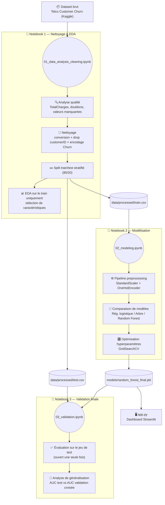

# 📉 Prédiction du Churn Client — Projet #3

> Projet réalisé dans le cadre du cursus **Directeur de projet en intelligence artificielle**
> (Année 1, classe **2-AIA01**) — L'École Multimédia.

---

## 📖 Contexte

Une entreprise de télécommunications souhaite anticiper la résiliation de ses clients
(*churn*) pour agir avant qu'ils ne partent. Ce projet développe, compare et optimise
plusieurs modèles de Machine Learning pour prédire ce risque, à partir du dataset public
[Telco Customer Churn](https://www.kaggle.com/datasets/blastchar/telco-customer-churn) (Kaggle).

---

## 🎯 Objectifs

- 🧹 Analyser la qualité du dataset et préparer les données pour l'apprentissage
- 🤖 Développer et comparer plusieurs familles de modèles (régression logistique, arbre de
  décision, Random Forest) pour identifier les clients à risque
- ⚙️ Optimiser les hyperparamètres et évaluer rigoureusement la performance des modèles
- 📊 Visualiser les résultats pour faciliter la prise de décision
- ✅ Valider la capacité du modèle final à généraliser sur des données jamais vues

---

## 💡 Utilité

Un client perdu coûte généralement **5 à 7 fois plus cher** à remplacer qu'à retenir. Ce
projet permet à une équipe marketing/rétention de :

- 🔍 **Identifier en amont** les clients présentant un risque élevé de résiliation, plutôt
  que de constater le départ après coup
- 🎯 **Prioriser les actions de rétention** (remise, appel, offre) selon un score de risque
  plutôt que de cibler au hasard
- 📈 **Explorer les résultats sans compétence technique**, grâce au dashboard interactif
- 🧠 **Comprendre les leviers du churn** (type de contrat, mode de paiement, services
  souscrits) pour agir aussi sur les causes, pas seulement sur les symptômes

---

## 🗂️ Structure du projet

```
├── data/
│   ├── raw/                              # Dataset brut (non versionné)
│   └── processed/                        # train.csv / test.csv après nettoyage et split
├── notebooks/
│   ├── 01_data_analysis_cleaning.ipynb   # Analyse qualité, EDA, nettoyage, split train/test
│   ├── 02_modeling.ipynb                 # Pipeline, modèles, comparaison, optimisation
│   └── 03_validation.ipynb               # Validation finale sur le jeu de test
├── models/
│   ├── random_forest_final.pkl           # Modèle final entraîné (pipeline complet)
│   └── random_forest_final_meta.json     # Hyperparamètres et score de validation croisée
├── reports/
│   └── figures/                          # Graphiques exportés
├── app.py                                # Dashboard interactif (Streamlit)
├── requirements.txt
└── README.md
```

---

## 🔄 Pipeline de traitement



---

## 🛠️ Installation

```bash
python3 -m venv venv
source venv/bin/activate          # venv\Scripts\activate sous Windows
pip install -r requirements.txt
```

## ▶️ Reproduire le projet

Exécuter les notebooks dans l'ordre :

1. **`01_data_analysis_cleaning.ipynb`** — charge le dataset brut, analyse la qualité des
   données, effectue l'EDA, nettoie et sépare train/test (sauvegardés dans `data/processed/`)
2. **`02_modeling.ipynb`** — construit le pipeline de préprocessing, entraîne et compare
   plusieurs modèles, optimise les hyperparamètres par recherche en grille, sauvegarde le
   modèle final dans `models/`
3. **`03_validation.ipynb`** — charge le modèle final et évalue sa performance sur le jeu
   de test (jamais utilisé auparavant), analyse la capacité de généralisation

## 📊 Dashboard interactif

```bash
streamlit run app.py
```

Permet d'explorer le taux de churn par variable, de tester l'effet du seuil de décision en
temps réel, de visualiser l'importance des variables, et de simuler la prédiction pour un
client donné.

---

## 🏆 Résultats

| Modèle | AUC (CV) | F1 | Précision | Rappel |
|---|---|---|---|---|
| Régression logistique (L2) | 0.846 ± 0.013 | 0.593 | 0.653 | 0.543 |
| Arbre de décision (max_depth=5) | 0.829 ± 0.011 | 0.577 | 0.618 | 0.542 |
| **Random Forest (optimisé)** | **0.848 ± 0.011** | **0.633** | 0.534 | **0.777** |

**✅ Modèle retenu : Random Forest** (`class_weight="balanced"`, `min_samples_leaf=10`,
`n_estimators=200`). AUC de **0.845 sur le jeu de test** (contre 0.848 en validation
croisée, écart de 0.003) — bonne capacité de généralisation confirmée. Le choix de
`class_weight="balanced"` privilégie le rappel (0.79) sur la précision, cohérent avec le
coût métier asymétrique du churn.

## 🧪 Méthodologie

- Préprocessing encapsulé dans un `Pipeline` scikit-learn pour éviter toute fuite de
  données pendant la validation croisée
- Validation croisée stratifiée à 5 plis pour toutes les comparaisons de modèles
- Jeu de test isolé dès le départ, utilisé une seule fois pour la validation finale
- Optimisation des hyperparamètres par `GridSearchCV` (critère : AUC-ROC)

---

## 🚀 Pistes de déploiement

- **🖥️ Dashboard web** : héberger `app.py` sur Streamlit Community Cloud, Render ou
  Railway pour un accès sans installation, partageable avec l'équipe marketing
- **🔌 API REST** : exposer le modèle via FastAPI/Flask (`POST /predict`), consommable
  directement par le CRM de l'entreprise pour scorer un client en temps réel
- **⏱️ Scoring par lot** : un job planifié (cron, Airflow) qui score l'ensemble du
  portefeuille client chaque semaine et alimente une liste de clients à contacter
- **📡 Monitoring en production** : surveiller la dérive des données et la dégradation de
  performance du modèle dans le temps avec des outils comme **Aporia** ou **Evidently**,
  et déclencher un réentraînement périodique si nécessaire

## 💼 Recommandations business

- 📄 **Contrats mensuels** : taux de churn de 43 % contre 3 % en engagement 2 ans — inciter
  à la migration vers des contrats plus longs (remise, avantages fidélité)
- 🌐 **Fibre optique** : churn de 42 %, le plus élevé de toutes les catégories — investiguer
  la qualité perçue du service et la sensibilité au prix sur ce segment
- 💳 **Paiement par chèque électronique** : churn de 46 % contre 15-19 % pour les autres
  modes — encourager la migration vers le prélèvement automatique
- 🛡️ **Absence de services de sécurité/support** (`OnlineSecurity`, `TechSupport`) :
  associée à un churn ~3x plus élevé — envisager de les inclure gratuitement les premiers
  mois pour renforcer la fidélisation
- 🆕 **Nouveaux clients** (faible ancienneté) : population la plus à risque — renforcer
  l'accompagnement et l'onboarding dans les premiers mois d'abonnement
- 🎚️ **Seuil de décision ajustable** : selon le budget de la campagne de rétention,
  abaisser le seuil (ex. 0.3) permet de détecter jusqu'à 91 % des churners, au prix de plus
  de fausses alertes — un arbitrage à piloter selon la capacité opérationnelle de l'équipe

---

## 👤 Auteur

**Levi Gnakale** — classe 2-AIA01, L'École Multimédia